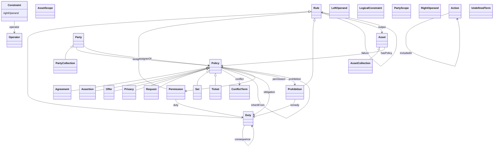

```mermaid
	classDiagram

    
    class Action {
    
    }

    class Agreement {
    
    }

    class Assertion {
    
    }

    class Asset {
    
    }

    class AssetCollection {
    
    }

    class AssetScope {
    
    }

    class ConflictTerm {
    
    }

    class Constraint {
    
    }

    class Duty {
    
    }

    class LeftOperand {
    
    }

    class LogicalConstraint {
    
    }

    class Offer {
    
    }

    class Operator {
    
    }

    class Party {
    
    }

    class PartyCollection {
    
    }

    class PartyScope {
    
    }

    class Permission {
    
    }

    class Policy {
    
    }

    class Privacy {
    
    }

    class Prohibition {
    
    }

    class Request {
    
    }

    class RightOperand {
    
    }

    class Rule {
    
    }

    class Set {
    
    }

    class Ticket {
    
    }

    class UndefinedTerm {
    
    }


    
    Policy <|-- Agreement 
    
    Policy <|-- Assertion 
    
    Policy <|-- Offer 
    
    Policy <|-- Privacy 
    
    Policy <|-- Request 
    
    Policy <|-- Set 
    
    Policy <|-- Ticket 
    
    Asset <|-- AssetCollection 
    
    Rule <|-- Duty 
    
    Rule <|-- Permission 
    
    Rule <|-- Prohibition 
    
    Party <|-- PartyCollection 
    

Party  --> Policy   :assigneeOf  

Party  --> Policy   :assignerOf  

Policy  --> ConflictTerm   :conflict  

Duty  --> Duty   :consequence  

Permission  --> Duty   :duty  

Rule  --> Rule   :failure  

Asset  --> Policy   :hasPolicy  

Action  --> Action   :implies  

Action  --> Action   :includedIn  

Policy  --> Policy   :inheritFrom  

Policy  --> Duty   :obligation  

Constraint  --> Operator   :operator  

Rule  --> Asset   :output  

Policy  --> Permission   :permission  

Policy  --> Prohibition   :prohibition  

Prohibition  --> Duty   :remedy  

    
    class Constraint  {
    
    
        rightOperand  
     
    } 
    
```