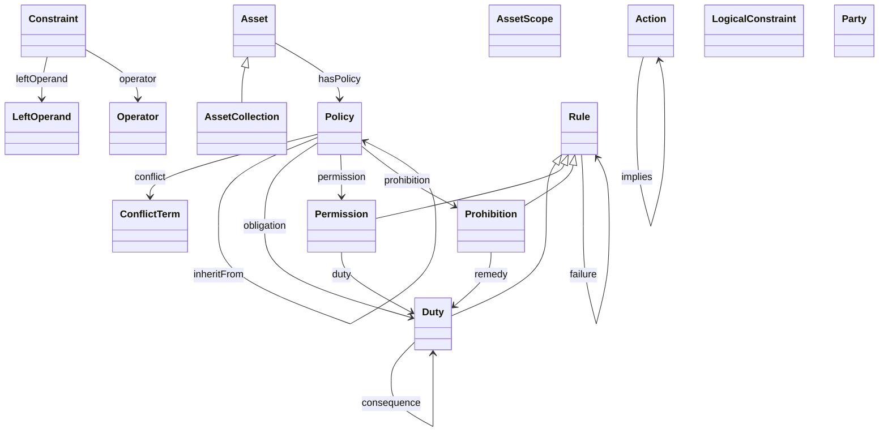

```mermaid
	classDiagram

    
    class AssetCollection {
    
    }

    class Action {
    
    }

    class Asset {
    
    }

    class AssetScope {
    
    }

    class ConflictTerm {
    
    }

    class Constraint {
    
    }

    class Duty {
    
    }

    class LeftOperand {
    
    }

    class LogicalConstraint {
    
    }

    class Operator {
    
    }

    class Permission {
    
    }

    class Policy {
    
    }

    class Prohibition {
    
    }

    class Rule {
    
    }

    class Party {
    
    }


    
    Asset <|-- AssetCollection 
    
    Rule <|-- Duty 
    
    Rule <|-- Permission 
    
    Rule <|-- Prohibition 
    

Policy  --> ConflictTerm   :conflict  

Duty  --> Duty   :consequence  

Permission  --> Duty   :duty  

Rule  --> Rule   :failure  

Asset  --> Policy   :hasPolicy  

Action  --> Action   :implies  

Policy  --> Policy   :inheritFrom  

Constraint  --> LeftOperand   :leftOperand  

Policy  --> Duty   :obligation  

Constraint  --> Operator   :operator  

Policy  --> Permission   :permission  

Policy  --> Prohibition   :prohibition  

Prohibition  --> Duty   :remedy  

    
```