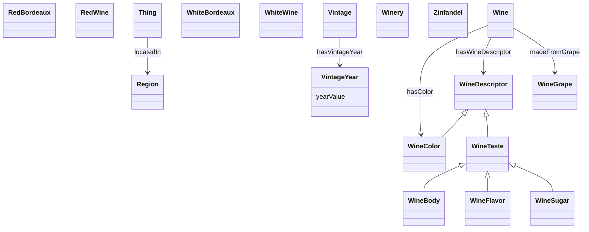

```mermaid
	classDiagram

    
    class RedBordeaux {
    
    }

    class RedWine {
    
    }

    class Region {
    
    }

    class Vintage {
    
    }

    class VintageYear {
    
    }

    class WhiteBordeaux {
    
    }

    class WhiteWine {
    
    }

    class Wine {
    
    }

    class WineBody {
    
    }

    class WineColor {
    
    }

    class WineDescriptor {
    
    }

    class WineFlavor {
    
    }

    class WineGrape {
    
    }

    class WineSugar {
    
    }

    class WineTaste {
    
    }

    class Winery {
    
    }

    class Zinfandel {
    
    }


    
    WineTaste <|-- WineBody 
    
    WineTaste <|-- WineFlavor 
    
    WineTaste <|-- WineSugar 
    
    WineDescriptor <|-- WineColor 
    
    WineDescriptor <|-- WineTaste 
    

Wine  --> WineColor   :hasColor  

Vintage  --> VintageYear   :hasVintageYear  

Wine  --> WineDescriptor   :hasWineDescriptor  

Thing  --> Region   :locatedIn  

Wine  --> WineGrape   :madeFromGrape  

    
    class VintageYear  {
    
    
        yearValue  
     
    } 
    
```