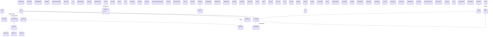

```mermaid
	classDiagram

    
    class Wine {
    
    }

    class Vintage {
    
    }

    class WineGrape {
    
    }

    class WhiteWine {
    
    }

    class WhiteTableWine {
    
    }

    class TableWine {
    
    }

    class WhiteNonSweetWine {
    
    }

    class WhiteLoire {
    
    }

    class Loire {
    
    }

    class WhiteBurgundy {
    
    }

    class Burgundy {
    
    }

    class WhiteBordeaux {
    
    }

    class Bordeaux {
    
    }

    class Region {
    
    }

    class VintageYear {
    
    }

    class Zinfandel {
    
    }

    class Winery {
    
    }

    class WineDescriptor {
    
    }

    class WineTaste {
    
    }

    class WineColor {
    
    }

    class WineSugar {
    
    }

    class WineFlavor {
    
    }

    class WineBody {
    
    }

    class Tours {
    
    }

    class SweetWine {
    
    }

    class SweetRiesling {
    
    }

    class Riesling {
    
    }

    class StEmilion {
    
    }

    class SemillonOrSauvignonBlanc {
    
    }

    class Semillon {
    
    }

    class SauvignonBlanc {
    
    }

    class Sauternes {
    
    }

    class Sancerre {
    
    }

    class RoseWine {
    
    }

    class RedWine {
    
    }

    class RedTableWine {
    
    }

    class RedBurgundy {
    
    }

    class RedBordeaux {
    
    }

    class Port {
    
    }

    class PinotNoir {
    
    }

    class PinotBlanc {
    
    }

    class PetiteSyrah {
    
    }

    class Pauillac {
    
    }

    class Medoc {
    
    }

    class Muscadet {
    
    }

    class Meursault {
    
    }

    class Merlot {
    
    }

    class Meritage {
    
    }

    class Margaux {
    
    }

    class LateHarvest {
    
    }

    class ItalianWine {
    
    }

    class IceWine {
    
    }

    class DessertWine {
    
    }

    class GermanWine {
    
    }

    class Gamay {
    
    }

    class FullBodiedWine {
    
    }

    class FrenchWine {
    
    }

    class EarlyHarvest {
    
    }

    class DryWine {
    
    }

    class DryWhiteWine {
    
    }

    class DryRiesling {
    
    }

    class DryRedWine {
    
    }

    class CotesDOr {
    
    }

    class Chianti {
    
    }

    class CheninBlanc {
    
    }

    class Chardonnay {
    
    }

    class CaliforniaWine {
    
    }

    class TexasWine {
    
    }

    class CabernetSauvignon {
    
    }

    class CabernetFranc {
    
    }

    class Beaujolais {
    
    }

    class Anjou {
    
    }

    class AmericanWine {
    
    }

    class AlsatianWine {
    
    }


    
    PotableLiquid <|-- Wine 
    
    Grape <|-- WineGrape 
    
    WineDescriptor <|-- WineTaste 
    
    WineDescriptor <|-- WineColor 
    
    WineTaste <|-- WineSugar 
    
    WineTaste <|-- WineFlavor 
    
    WineTaste <|-- WineBody 
    
    DessertWine <|-- SweetRiesling 
    
    Bordeaux <|-- Sauternes 
    
    RedWine <|-- Port 
    
    Wine <|-- LateHarvest 
    
    Wine <|-- EarlyHarvest 
    
    Wine <|-- DessertWine 
    
    ItalianWine <|-- Chianti 
    

Thing  --> Region   :locatedIn  

Region  --> Region   :adjacentRegion  

Vintage  --> VintageYear   :hasVintageYear  

Wine  --> WineGrape   :madeFromGrape  

Wine  --> WineDescriptor   :hasWineDescriptor  

Wine  --> WineColor   :hasColor  

    
    class VintageYear  {
    
    
        yearValue  
     
    } 
    
```